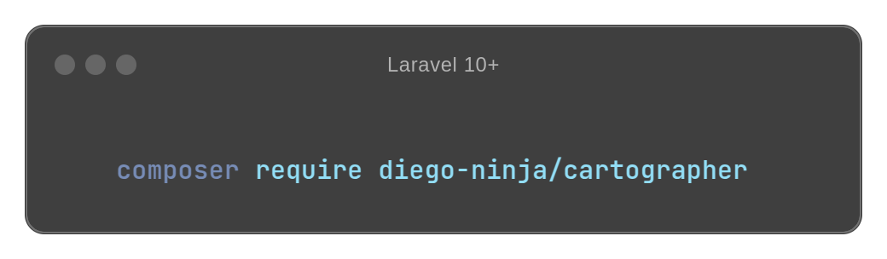

<p align="center">
    
</p>

[](https://www.laravel.com)
[](https://packagist.org/packages/diego-ninja/cartographer)
[](https://packagist.org/packages/diego-ninja/cartographer)

[](https://opensource.org/licenses/MIT)

[](https://hitsofcode.com/github/diego-ninja/laravel-devices/view?branch=main&label=Hits-of-Code&color=blue)
[](https://wakatime.com/badge/user/bd65f055-c9f3-4f73-92aa-3c9810f70cc3/project/67658154-f6da-4cae-9383-814044d4c8ff)
# Cartographer

Generate API collections automatically from your Laravel API endpoints. Supports Postman and Insomnia formats.

## 📦 Installation

You can install the package via composer:

```bash
composer require diego-ninja/cartographer
```

The package will automatically register its service provider.

## 🎛️ Configuration

Publish the configuration file:

```bash
php artisan vendor:publish --tag="cartographer-config"
```

This will create a `config/cartographer.php` file where you can configure:
- Base URL for your API
- Authentication settings
- Collection filename format
- Request body mode
- Headers
- Scripts configuration
- And more...

## 🚀 Usage

### Basic Usage

Generate a Postman collection:

```bash
php artisan cartographer:export
```

Generate an Insomnia collection:

```bash
php artisan cartographer:export --format=insomnia
```

### Authentication

You can specify authentication tokens when generating collections:

```bash
# Bearer token
php artisan cartographer:export --bearer=your-token

# Basic auth
php artisan cartographer:export --basic=username:password

# API Key
php artisan cartographer:export --apikey=your-api-key
```

### Customizing Endpoints

Use attributes to customize how your endpoints appear in the collection:

```php
use Ninja\Cartographer\Attributes\Collection;
use Ninja\Cartographer\Attributes\Request;

#[Collection(
    name: 'User Management',
    description: 'User management endpoints',
    group: 'Users'
)]
class UserController extends Controller
{
    #[Request(
        name: 'List Users',
        description: 'Get a list of all users',
        group: 'Users'
    )]
    public function index()
    {
        // Your code here
    }
}
```

## 🤝 Contributing

Thank you for considering contributing to Cartographer! The contribution guide can be found below:

1. Fork the repository
2. Create a new branch for your feature: `git checkout -b feature/awesome-feature`
3. Commit your changes: `git commit -m 'Add awesome feature'`
4. Push to the branch: `git push origin feature/awesome-feature`
5. Open a Pull Request

### Development Setup

```bash
# Clone your fork
git clone git@github.com:YOUR_USERNAME/cartographer.git

# Install dependencies
composer install

# Run tests
composer test
```

Please make sure to update tests as appropriate and adhere to the Laravel coding style defined in the `pint.json` file.

## 🙏 Credits

This project is developed and maintained by 🥷 [Diego Rin](https://diego.ninja) in his free time.

Special thanks to:

- [Laravel Framework](https://laravel.com/) for providing the most exciting and well-crafted PHP framework.
- [Andreas Elia](https://github.com/andreaselia) and [Tom Irons](https://github.com/tomirons) for developing the [inital code](https://github.com/andreaselia/laravel-api-to-postman) that serves Cartographer as starting point.
- All the contributors and testers who have helped to improve this project through their contributions.

If you find this project useful, please consider giving it a ⭐ on GitHub!

[ico-phpstan]: https://img.shields.io/badge/phpstan-max-blue?logo=data:image/png;base64,iVBORw0KGgoAAAANSUhEUgAAACAAAAAgCAYAAABzenr0AAAGb0lEQVR42u1Xe1BUZRS/y4Kg8oiR3FCCBUySESZBRCiaBnmEsOzeSzsg+KxYYO9dEEftNRqZjx40FRZkTpqmOz5S2LsXlEZBciatkQnHDGYaGdFy1EpGMHl/p/PdFlt2rk5O+J9n5nA/vtf5ned3lnlISpRhafBlLRLHCtJGVrB/ZBDsaw2lUqzReGAC46DstTYfnSCGUjaaDvgxACo6j3vUenNdImeRXqdnWV5az5rrnzeZznj8J+E5Ftsclhf3s4J4CS/oRx5Bvon8ZU65FGYQxAwcf85a7CeRz+C41THejueydCZ7AAK34nwv3kHP/oUKdOL4K7258fF7Cud427O48RQeGkIGJ77N8fZqlrcfRP4d/x90WQfHXLeBt9dTrSlwl3V65ynWLM1SEA2qbNQckbe4Xmww10Hmy3shid0CMcmlEJtSDsl5VZBdfAgMvI3uuR+moJqN6LaxmpsOBeLCDmTifCB92RcQmbAUJvtqALc5sQr8p86gYBCcFdBq9wOin7NQax6ewlB6rqLZHf23FP10y3lj6uJtEBg2HxiVCtzd3SEwMBCio6Nh9uzZ4O/vLwOZ4OUNM2NyIGPFrvuzBG//lRPs+VQ2k1ki+ePkd84bskz7YFpYgizEz88P8vPzYffu3dDS0gJNTU1QXV0NqampRK1WIwgfiE4qhOyig0rC+pCvK8QUoML7uJVHA5kcQUp3DSpqWjc3d/Dy8oKioiLo6uqCoaEhuHb1KvT09AAhBFpbW4lOpyMyyIBQSCmoUQLQzgniNvz+obB2HS2RwBgE6dOxCyJogmNkP2u1Wrhw4QJ03+iGrR9XEd3CTNBn6eCbo40wPDwMdXV1BF1DVG5qiEtboxSUP6J71+D3NwUAhLOIRQzm7lnnhYUv7QFv/yDZ/Lm5ubK2DVI9iZ8bR8JDtEB57lNzENQN6OjoIGlpabIVZsYaMTO+hrikRRA1JxmSX9hE7/sJtVyF38tKsUCVZxBhz9jI3wGT/QJlADzPAyXrnj0kInzGHQCRMyOg/ed2uHjxIuE4TgYQHq2DLJqumashY+lnsMC4GVC5do6XVuK9l+4SkN8y+GfYeVJn2g++U7QygPT0dBgYGIDvT58mnF5PQcjC83PzSF9fH7S1tZGEhAQZQOT8JaA317oIkM6jS8uVLSDzOQqg23Uh+MlkOf00Gg0cP34c+vv74URzM9n41gby/rvvkc7OThlATU3NCGYJUXt4QaLuTYwBcTSOBmj1RD7D4Tsix4ByOjZRF/zgupDEbgZ3j4ly/qekpND0o5aQ44HS4OAgsVqtI1gTZO01IbG0aP1bknnxCDUvArHi+B0lJSlzglTFYO2udF3Ql9TCrHn5oEIreHp6QlRUFJSUlJCqqipSWVlJ8vLyCGYIFS7HS3zGa87mv4lcjLwLlStlLTKYYUUAlvrlDGcW45wKxXX6aqHZNutM+1oQBHFTewAKkoH4+vqCj48PYAGS5yb5amjNoO+CU2SL53NKpDD0vxHHmOJir7L5xUvZgm0us2R142ScOIyVqYvlpWU4XoHIP8DXL2b+wjdWeXh6U2FjmIIKmbWAYPFRMus62h/geIvjOQYlpuDysQrLL6Ger49HgW8jqvXUhI7UvDb9iaSTDqHtyItiF5Suw5ewF/Nd8VJ6zlhsn06bEhwX4NyfCvuGEeRpTmh4mkG68yDpyuzB9EUcjU5awbAgncPlAeSdAQER0zCndzqVbeXC4qDsMpvGEYBXRnsDx4N3Auf1FCTjTIaVtY/QTmd0I8bBVm1kejEubUfO01vqImn3c49X7qpeqI9inIgtbpxK3YrKfIJCt+OeV2nfUVFR4ca4EkVENyA7gkYcMfB1R5MMmxZ7ez/2KF5SSN1yV+158UPsJT0ZBcI2bRLtIXGoYu5FerOUiJe1OfsL3XEWH43l2KS+iJF9+S4FpcNgsc+j8cT8H4o1bfPg/qkLt50uJ1RzdMsGg0UqwfEN114Pwb1CtWTGg+Y9U5ClK9x7xUWI7BI5VQVp0AVcQ3bZkQhmnEgdHhKyNSZe16crtBIlc7sIb6cRLft2PCgoKGjijBDtjrAQ7a3EdMsxzIRflAFIhPb6mHYmYwX+WBlPQgskhgVryyJCQyNyBLsBQdQ6fgsQhyt6MSOOsWZ7gbH8wETmgRKAijatNL8Ngm0xx4tLcsps0Wzx4al0jXlI40B/A3pa144MDtSgAAAAAElFTkSuQmCC
[link-phpstan]: https://phpstan.org/
